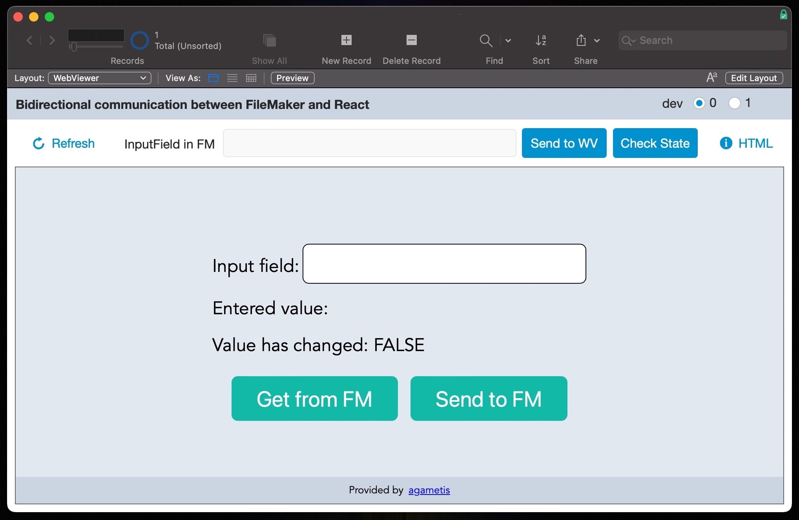

# Bidirectional communication between FileMaker and React in WebViewer



## Why this demo

With the package [fm-webviewer-fetch](https://github.com/proofgeist/fm-webviewer-fetch) we have a module for the communication with FileMaker from within the WebViewer. There is no standardized way to communicate from FileMaker to the WebViewer.

This demo shows the communication in both directions for a React project.

## How to use it

Load the repo.

```bash
git clone https://github.com/agametis/fm-react-demo.git
```

Go into the folder `fm-react-demo` and run `yarn` to initialize the project.

```bash
cd fm-react-demo/
yarn
```

> [!NOTE]
> In case you are using `npm` change the calls for the appropriated scripts in `package.json`

Start the development server.

```bash
yarn start
```

Using the included FileMaker file `fmReactDemo.fmp12` you can access the running sever (dev = 1) or use the current version of the project in the FileMaker field "start::HTML" (dev = 0).

> [!NOTE]
> username and password for the file is: `admin`

> [!IMPORTANT]
> Currently, in version 2.1.1 of the module `@proofgeist/fm-webviewer-fetch` you need to change the file references in the modules own `package.json` file (`./node_modules/@proofgeist/fm-webviewer-fetch/package.json`). Please update the following lines manually to:

```JSON
  "main": "./dist/main.umd.cjs",
  "browser": "./dist/main.umd.cjs",
  "module": "./dist/main.cjs",
```

## Using in FileMaker

### Manually

The result of the nodejs-script `build` can be used directly in FileMaker. The content of the resulting `html` file in folder `dist` can be copied into the field `start::HTML` in FileMaker.

### Automated

For an automated pasting of the content, the nodejs-script `deploy-to-fm` can be used. In order to have this working, the parameters in the `config.js` file in folder `tooling` must be properly set up.
